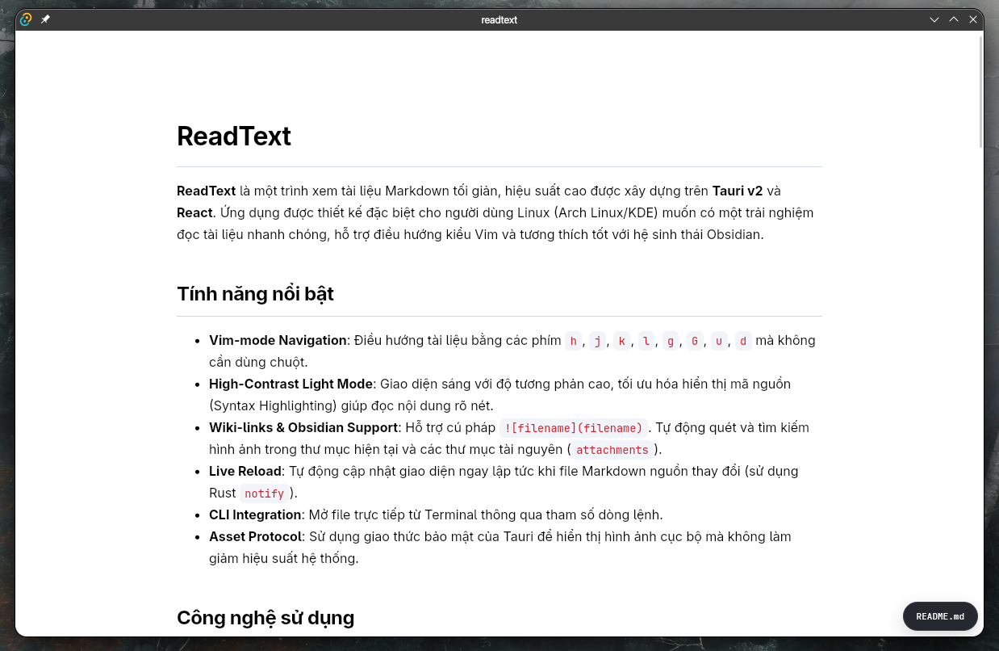

# ReadText

**ReadText** là một trình xem tài liệu Markdown tối giản, hiệu suất cao được xây dựng trên **Tauri v2** và **React**. Ứng dụng được thiết kế đặc biệt cho người dùng Linux (Arch Linux/KDE) muốn có một trải nghiệm đọc tài liệu nhanh chóng, hỗ trợ điều hướng kiểu Vim và tương thích tốt với hệ sinh thái Obsidian.



## Tính năng nổi bật

- **Vim-mode Navigation**: Điều hướng tài liệu bằng các phím `h`, `j`, `k`, `l`, `g`, `G`, `u`, `d` mà không cần dùng chuột.
- **High-Contrast Light Mode**: Giao diện sáng với độ tương phản cao, tối ưu hóa hiển thị mã nguồn (Syntax Highlighting) giúp đọc nội dung rõ nét.
- **Wiki-links & Obsidian Support**: Hỗ trợ cú pháp `![[filename]]`. Tự động quét và tìm kiếm hình ảnh trong thư mục hiện tại và các thư mục tài nguyên (`attachments`).
- **Live Reload**: Tự động cập nhật giao diện ngay lập tức khi file Markdown nguồn thay đổi (sử dụng Rust `notify`).
- **CLI Integration**: Mở file trực tiếp từ Terminal thông qua tham số dòng lệnh.
- **Asset Protocol**: Sử dụng giao thức bảo mật của Tauri để hiển thị hình ảnh cục bộ mà không làm giảm hiệu suất hệ thống.

## Công nghệ sử dụng

- **Backend**: Rust, Tauri v2, WalkDir, Notify.
- **Frontend**: React, TypeScript, React-Markdown.
- **Highlighter**: React Syntax Highlighter (Prism).

## Cài đặt

### Yêu cầu hệ thống

- Rust & Cargo
- Node.js & pnpm
- Các thư viện Webview2 (Windows) hoặc WebKit2GTK (Linux).

### Các bước cài đặt

1. Clone repository:

```bash
git clone https://github.com/yourusername/readtext.git
cd readtext

```

2. Cài đặt dependencies:

```bash
pnpm install

```

3. Chạy ứng dụng ở chế độ phát triển:

```bash
pnpm tauri dev

```

4. Build ứng dụng:

```bash
pnpm tauri build

```

## Hướng dẫn sử dụng

### Mở file từ Terminal

Sau khi cài đặt, bạn có thể mở bất kỳ file nào bằng lệnh:

```bash
readtext /đường/dẫn/đến/file.md

```

### Phím tắt điều hướng (Vim-style)

| Phím | Chức năng             |
| ---- | --------------------- |
| `j`  | Cuộn xuống            |
| `k`  | Cuộn lên              |
| `d`  | Cuộn xuống nửa trang  |
| `u`  | Cuộn lên nửa trang    |
| `gg` | Nhảy về đầu trang     |
| `G`  | Nhảy xuống cuối trang |

### Cấu hình hình ảnh

Ứng dụng sẽ tự động tìm kiếm hình ảnh trong:

1. Cùng thư mục với file `.md`.
2. Thư mục con (độ sâu tối đa 3 cấp).
3. Thư mục chỉ định trong cấu hình Rust (mặc định là thư mục Obsidian của bạn).

## Cấu hình mặc định hệ thống (Linux)

Để đặt ReadText làm ứng dụng mặc định cho file `.md`, hãy tạo file desktop hoặc sử dụng lệnh:

```bash
xdg-mime default com.mintori.readtext.desktop text/markdown

```

## Giấy phép

## Dự án này được phát hành dưới giấy phép MIT.
